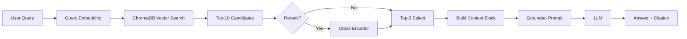

# Architecture — RAG Pipeline (Day 08 Lab)

> Template: Điền vào các mục này khi hoàn thành từng sprint.
> Deliverable của Documentation Owner.

## 1. Tổng quan kiến trúc

```
[Raw Docs]
    ↓
[index.py: Preprocess → Chunk → Embed → Store]
    ↓
[ChromaDB Vector Store]
    ↓
[rag_answer.py: Query → Retrieve → Rerank → Generate]
    ↓
[Grounded Answer + Citation]
```

**Mô tả ngắn gọn:**
Nhóm xây một trợ lý hỏi đáp nội bộ cho CS + IT Helpdesk, tập trung vào tài liệu policy, SLA, access control và HR policy.  
Pipeline đi theo hướng retrieval-first: luôn retrieve chunk có metadata trước khi tạo câu trả lời, và có cơ chế abstain khi thiếu dữ liệu.  
Mục tiêu là giảm hallucination, bảo đảm truy vết nguồn bằng citation, và chạy ổn định ở chế độ offline để demo end-to-end.

---

## 2. Indexing Pipeline (Sprint 1)

### Tài liệu được index
| File | Nguồn | Department | Số chunk |
|------|-------|-----------|---------|
| `policy_refund_v4.txt` | policy/refund-v4.pdf | CS | 6 |
| `sla_p1_2026.txt` | support/sla-p1-2026.pdf | IT | 5 |
| `access_control_sop.txt` | it/access-control-sop.md | IT Security | 7 |
| `it_helpdesk_faq.txt` | support/helpdesk-faq.md | IT | 6 |
| `hr_leave_policy.txt` | hr/leave-policy-2026.pdf | HR | 5 |

### Quyết định chunking
| Tham số | Giá trị | Lý do |
|---------|---------|-------|
| Chunk size | 400 tokens (xấp xỉ theo ký tự) | Giữ đủ ngữ cảnh điều khoản nhưng không quá dài khi đưa vào prompt |
| Overlap | 80 tokens | Hạn chế mất ngữ cảnh khi tách theo paragraph |
| Chunking strategy | Heading-based + paragraph packing | Ưu tiên ranh giới tự nhiên (`=== Section ===`), giảm cắt giữa điều khoản |
| Metadata fields | source, section, effective_date, department, access | Phục vụ filter, freshness, citation |

### Embedding model
- **Model**: Hash embedding 384 chiều (offline-safe), có fallback kiến trúc cho OpenAI/local model nếu bật online mode
- **Vector store**: ChromaDB (PersistentClient)
- **Similarity metric**: Cosine

---

## 3. Retrieval Pipeline (Sprint 2 + 3)

### Baseline (Sprint 2)
| Tham số | Giá trị |
|---------|---------|
| Strategy | Dense (embedding similarity) |
| Top-k search | 10 |
| Top-k select | 3 |
| Rerank | Không |

### Variant (Sprint 3)
| Tham số | Giá trị | Thay đổi so với baseline |
|---------|---------|------------------------|
| Strategy | Hybrid (Dense + Sparse BM25, RRF) | Dense -> Hybrid |
| Top-k search | 10 | Giữ nguyên |
| Top-k select | 3 | Giữ nguyên |
| Rerank | Có (lexical rerank nhẹ) | False -> True |
| Query transform | Không dùng riêng | Giữ nguyên |

**Lý do chọn variant này:**
Chọn hybrid + rerank vì corpus có cả nội dung tự nhiên (policy dạng câu) và keyword đặc thù (P1, Level 3, Approval Matrix, ERR-403).  
Dense-only có thể kéo về chunk đúng source nhưng sai section; BM25 giúp tăng hit ở keyword chính xác, rerank giúp giảm noise trước khi build prompt.

---

## 4. Generation (Sprint 2)

### Grounded Prompt Template
```
Answer only from the retrieved context below.
If the context is insufficient, say you do not know.
Cite the source field when possible.
Keep your answer short, clear, and factual.

Question: {query}

Context:
[1] {source} | {section} | score={score}
{chunk_text}

[2] ...

Answer:
```

### LLM Configuration
| Tham số | Giá trị |
|---------|---------|
| Model | Offline extractive generator (rule-based), không dùng external API |
| Temperature | 0 (để output ổn định cho eval) |
| Max tokens | 512 |

---

## 5. Failure Mode Checklist

> Dùng khi debug — kiểm tra lần lượt: index → retrieval → generation

| Failure Mode | Triệu chứng | Cách kiểm tra |
|-------------|-------------|---------------|
| Index lỗi | Retrieve về docs cũ / sai version | `inspect_metadata_coverage()` trong index.py |
| Chunking tệ | Chunk cắt giữa điều khoản | `list_chunks()` và đọc text preview |
| Retrieval lỗi | Không tìm được expected source | `score_context_recall()` trong eval.py |
| Generation lỗi | Answer không grounded / bịa | `score_faithfulness()` trong eval.py |
| Token overload | Context quá dài → lost in the middle | Kiểm tra độ dài context_block |

---

## 6. Diagram (tùy chọn)

> TODO: Vẽ sơ đồ pipeline nếu có thời gian. Có thể dùng Mermaid hoặc drawio.


